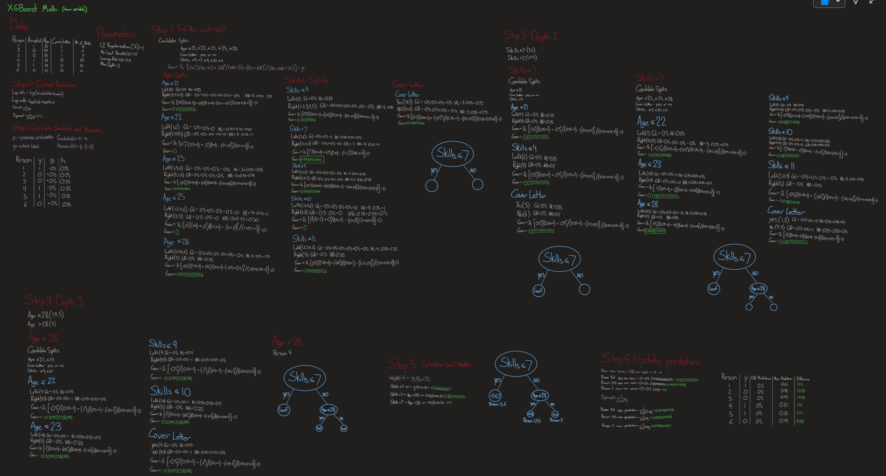
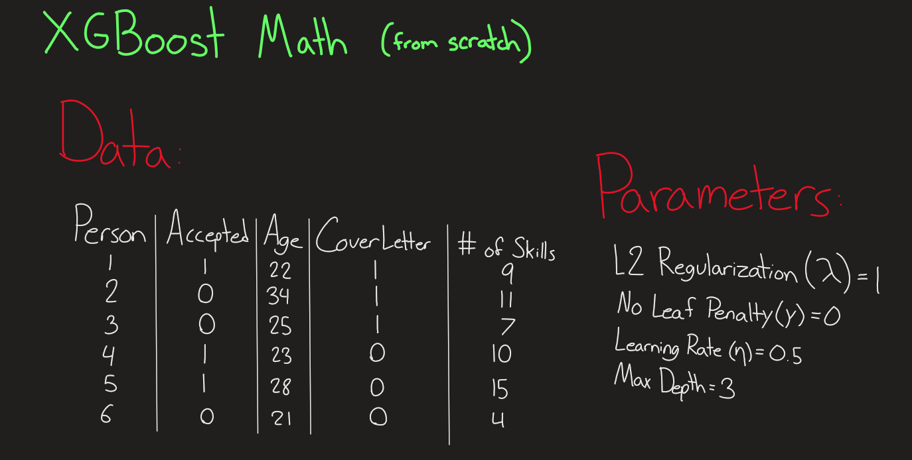

# XGBoost Math (from scratch)

Decision trees are algorithms that can be used to make predictions based on a series of decisions. For example, if you wanted to predict if someone was more likely to eat dinner at home or a restaurant, you could have a decision tree like this:

Based on this decision tree, if it is Tuesday and they have more than 10 ingredients at home, you would predict that the person would eat at home. A collection of decision trees with random sampling and feature selection can be called a random forest.

A boosted tree is different from random forests because it builds "smarter" trees that use prediction error to converge on an optimal prediction.

XGBoost is a gradient boosted decision tree algorithm that offers several advantages over basic decision trees, random forests, and basic gradient boosted trees. These advantages have made XGBoost one of the most popular machine learning algorithms over the past 10 years. In this example, I will go over some of the basic math of XGBoost and outline what makes this algorithm special.

## Full Notebook

## Setup
For this example, we will need some labeled data and to set some parameters. In the interest of limiting the computations, there will only be 6 rows and 3 features. Every unique value will require its own calculation down the line, so it is better to limit them now. Here, the data shows if a person was accepted for a position with features including age, the presence of a cover letter, and the number of skills. The data is mostly random, but I made sure to add in some patterns to replicate what might be seen in real data.

The parameters that will be used throughout are lambda (L2 regularization), gamma (no leaf penalty), and eta (learning rate/shrinkage size). I also set the max depth at 3, but that will not come into effect here. L2 regularization is one of the things that makes XGBoost different from other boosted trees. Regularization is used to prevent models from overfitting on the specifics of training data and instead force it to generalize. XGBoost uses L1 and L2 regularization, but it sets L1 regularization to 0 by default. L1 regularization penalizes the absolute value of each weight, which has a tendency to push weights to 0. This can be helpful with high-dimensional data, but since this example only has 3 features, L1 regularization will not be used. L2 regularization penalizes the square of each weight, meaning larger weights get punished disproportionately hard, leaving the model to spread weights across many features. A leaf penalty is used to set the ["minimum loss reduction required to make a further partition on a leaf node of the tree"](https://xgboost.readthedocs.io/en/stable/parameter.html), meaning that a larger leaf penalty should result in fewer splits because the tree needs to be more sure that each split is leading to a positive gain in accuracy. Learning rate/shrinkage size is used to adjust the effect of feature weights, with the goal of spreading out updates over more iterations.

The default values for these parameters are lambda = 1, gamma = 0, and eta = 0.3. I have chosen to use these default values, with the exception of eta, which I have increased to 0.5 to show a larger change over only one tree.

