# XGBoost Math (from scratch)

Decision trees are algorithms that can be used to make predictions based on a series of decisions. For example, if you wanted to predict if someone was more likely to eat dinner at home or a restaurant, you could have a decision tree like this:
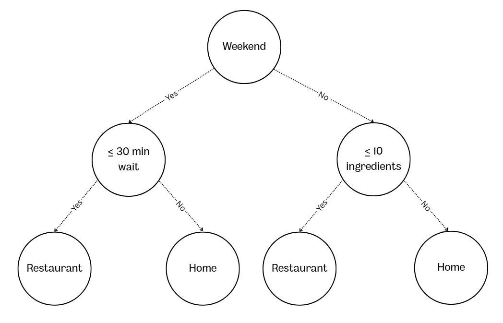
Based on this decision tree, if it is Tuesday and they have more than 10 ingredients at home, you would predict that the person would eat at home. A collection of decision trees with random sampling and feature selection can be called a random forest.

A boosted tree is different from random forests because it builds "smarter" trees that use prediction error to converge on an optimal prediction.

XGBoost is a gradient boosted decision tree algorithm that offers several advantages over basic decision trees, random forests, and basic gradient boosted trees. These advantages have made XGBoost one of the most popular machine learning algorithms over the past 10 years. In this example, I will go over some of the basic math of XGBoost and outline what makes this algorithm special.

## Full Notebook

## Setup
For this example, we will need some labeled data and to set some parameters. In the interest of limiting the computations, there will only be 6 rows and 3 features. Every unique value will require its own calculation down the line, so it is better to limit them now. Here, the data shows if a person was accepted for a position with features including age, the presence of a cover letter, and the number of skills. The data is mostly random, but I made sure to add in some patterns to replicate what might be seen in real data.

The parameters that will be used throughout are lambda (L2 regularization), gamma (no leaf penalty), and eta (learning rate/shrinkage size). I also set the max depth at 3, but that will not come into effect here. L2 regularization is one of the things that makes XGBoost different from other boosted trees. Regularization is used to prevent models from overfitting on the specifics of training data and instead force it to generalize. XGBoost uses L1 and L2 regularization, but it sets L1 regularization to 0 by default. L1 regularization penalizes the absolute value of each weight, which has a tendency to push weights to 0. This can be helpful with high-dimensional data, but since this example only has 3 features, L1 regularization will not be used. L2 regularization penalizes the square of each weight, meaning larger weights get punished disproportionately hard, leaving the model to spread weights across many features. A leaf penalty is used to set the ["minimum loss reduction required to make a further partition on a leaf node of the tree"](https://xgboost.readthedocs.io/en/stable/parameter.html), meaning that a larger leaf penalty should result in fewer splits because the tree needs to be more sure that each split is leading to a positive gain in accuracy. Learning rate/shrinkage size is used to adjust the effect of feature weights, with the goal of spreading out updates over more iterations.

The default values for these parameters are lambda = 1, gamma = 0, and eta = 0.3. I have chosen to use these default values, with the exception of eta, which I have increased to 0.5 to show a larger change over only one tree.

## Step 0: Initial Prediction
Unlike a basic decision tree, the first step is to make the initial prediction. We are predicting a binary variable, so we can use Log-odds. Log-odds is helpful for a binary classification problem like this because XGBoost needs continuous, unbounded values to iterate on. If the loss was just taken by subtracting the label from the prediction, for example, 0.5, then the next iteration could adjust it by 0.6, sending it outside of the 0-1 bounds. Each iteration adjusts the Log-odds value, not a probability. The result can then be sent into a sigmoid function to convert it back into a probability, which can be used to calculate the next step.

**Log in this equation refers to natural log (ln)*

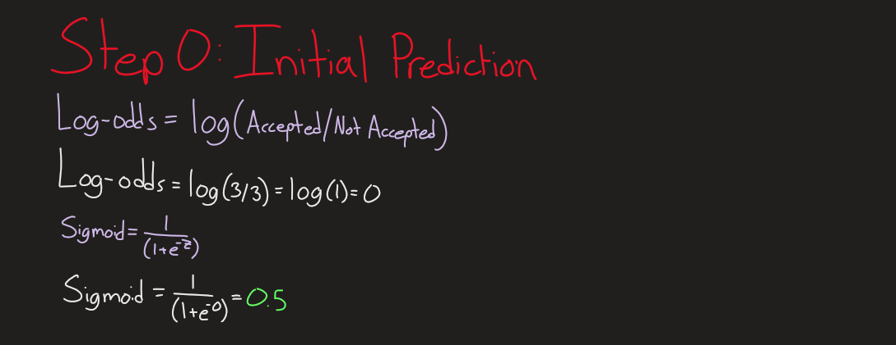

## Step 1: Calculate Gradients and Hessians
XGBoost uses both the 1st and 2nd derivative of the loss function. The 1st derivative (gradient) is the slope of the loss function at a prediction. This tells you the direction and magnitude of error. The 2nd derivative (hessian) measures how quickly the slope changes, which is helpful in knowing how much it is safe to adjust the prediction without overstepping a minima. These values can be calculated using the output from the sigmoid function in the previous step.

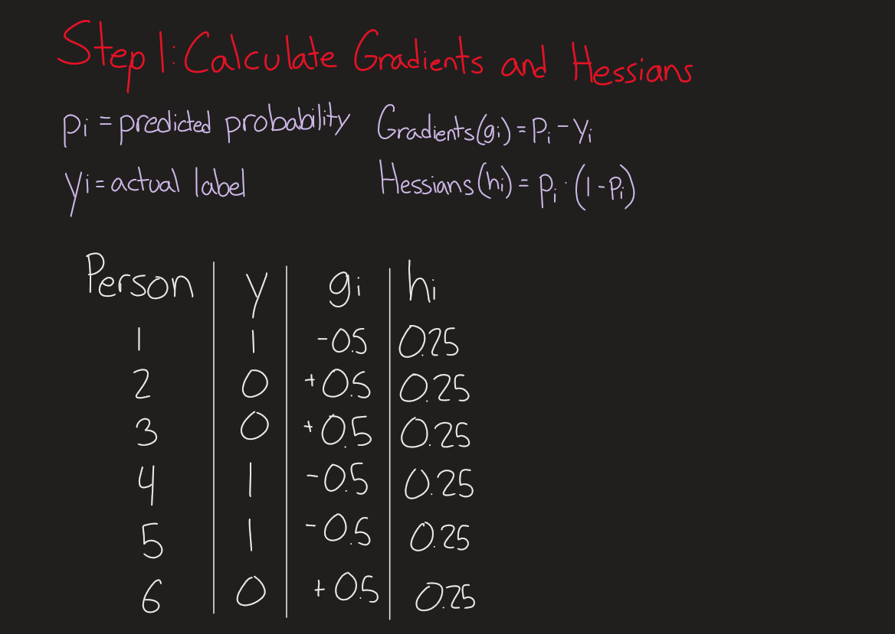

## Step 2: Find the root split
Now we can actually start to build the tree. This is done by evaluating the possible splits and choosing the one with the largest gain, using the gain equation from [Chen, Guestren (2016)](https://arxiv.org/pdf/1603.02754):

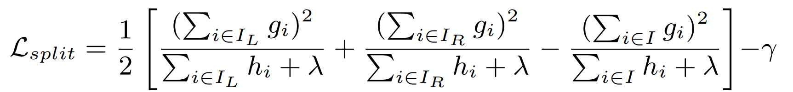

**For most practical applications, XGBoost will not actually evaluate on every candidate split. Instead, it uses other techniques like binning and column subsampling. For this example, it makes sense to evaluate all candidate splits.*

The equation above can be simplified and used on all the candidate splits. GL is gradient left, HL is hessian left, and the same for the right. Lambda also makes an appearance here to aid in the regularization that was mentioned earlier. Let's take the GL^2/(HL+lambda) portion of the equation. If there are a lot of examples on the left side of a split, for example, 400 * 0.25, this would be HL = 100. Adding a lambda of 1 does not have a relatively strong effect when it's used here. On the other hand, if there are not a lot of examples for a split, for example, 1 * 0.25, which would be HL = 0.25, then adding a lambda of 1 will drastically change the divisor. This is one of the strengths of L2 regularization, in that it affects smaller, more likely to overfit splits more heavily than larger ones.

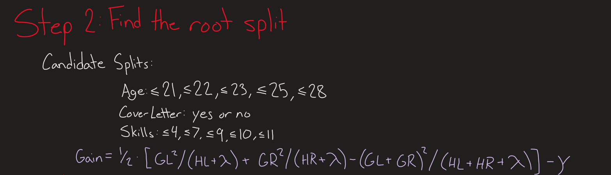

Once all the candidate splits are calculated, choosing the best split is as simple as finding the highest gain. In this case it is Skills less than or equal to 7.

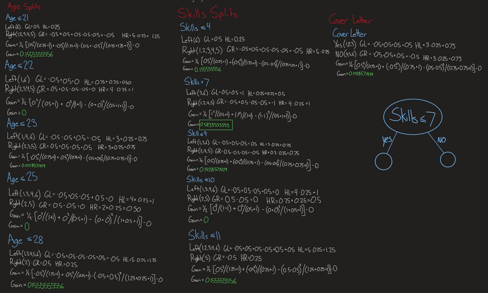

## Step 3: Depth 2
The root split is the best seperator of the entire dataset. The next split is the best seperator of the already partitioned data. Given the split of Skilss less than or equal to 7, people 3 and 6 are on the left and people 1, 2, 4, and 5 are on the right. Since none of the candidate splits account for a possitive gain, there are no logical further splits for this branch, meaning this node turns into a leaf and ends the branch. The right side largest gain for a candidate split is Age less than or equal to 28 with a gain of 0.4928571429. This is a good example of how the no leaf penalty value works. Here gamma is 0 but if that value was set to 0.5 for example, the gain would turn negative, meaning that there would be no positive gain for this branch and it would become a leaf. Since this is not the case Skills less than or equal to 7 becomes the next split on the right as show in the figure.

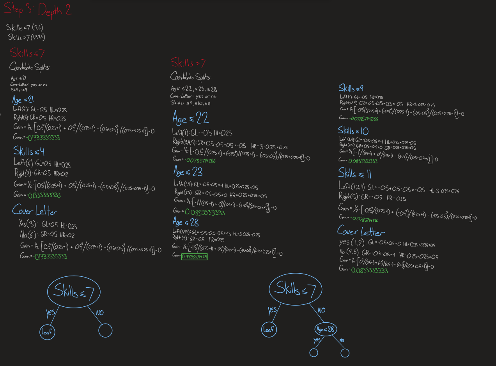

## Step 4: Depth 3
Looking at the data we can see that the data is already fully split, but I did the math anyway. As expected all the gains are negative and the nodes become leafs. Since max depth was set to 3 at the beggining this layer was the last chance to find splits.

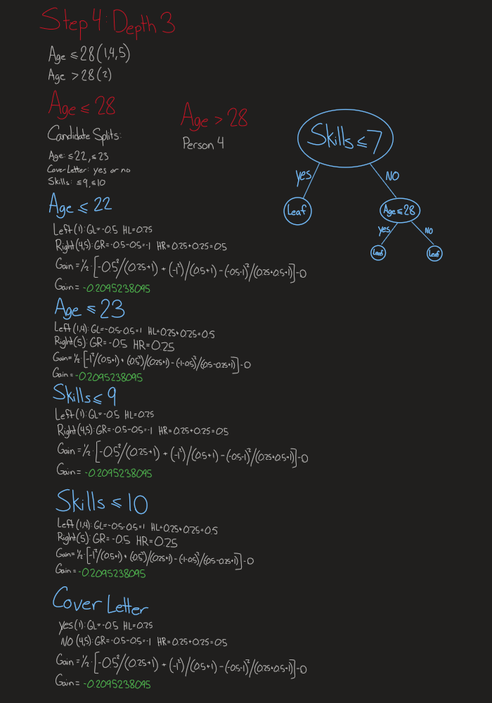

## Step 5: Calculate Leaf Weights

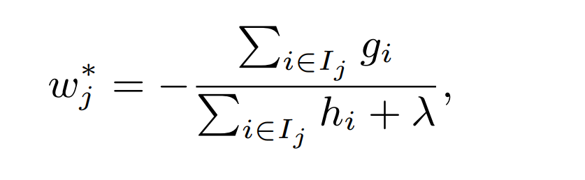

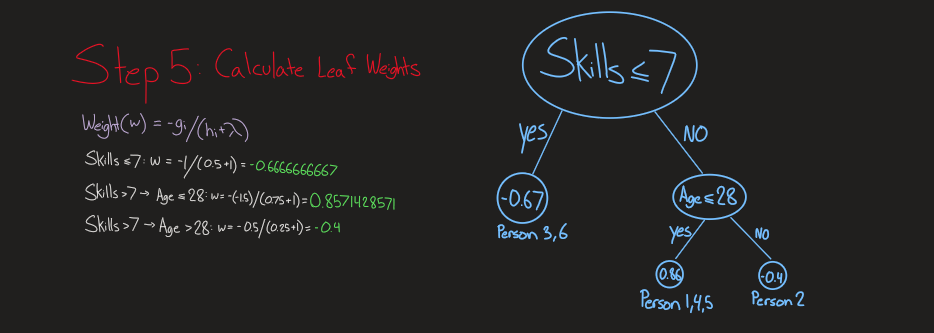

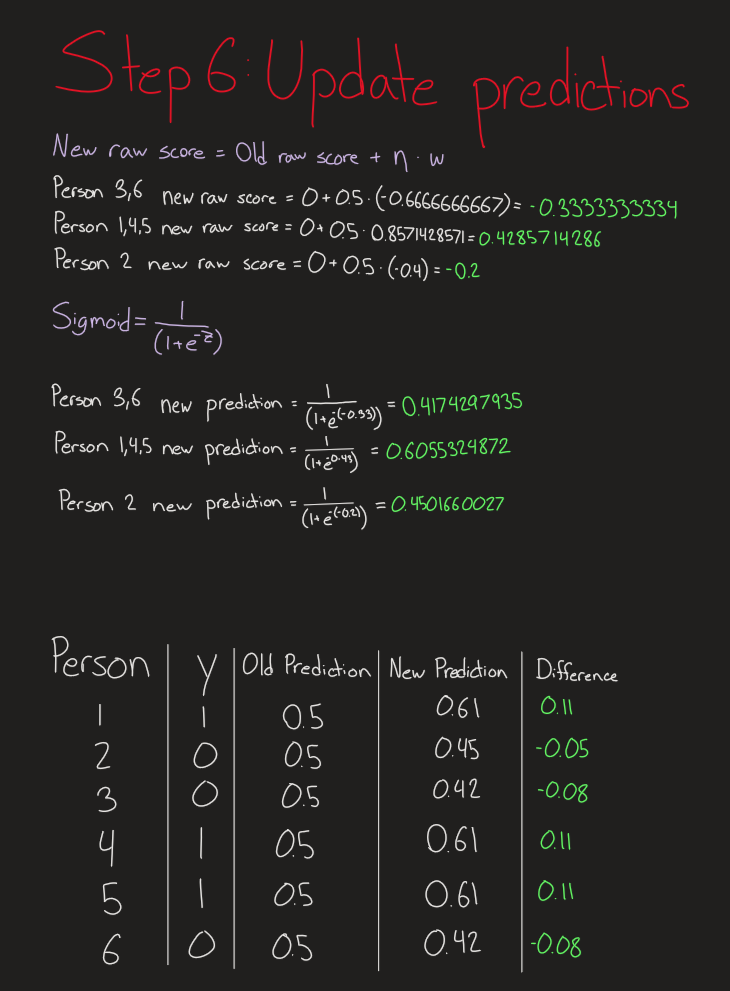

